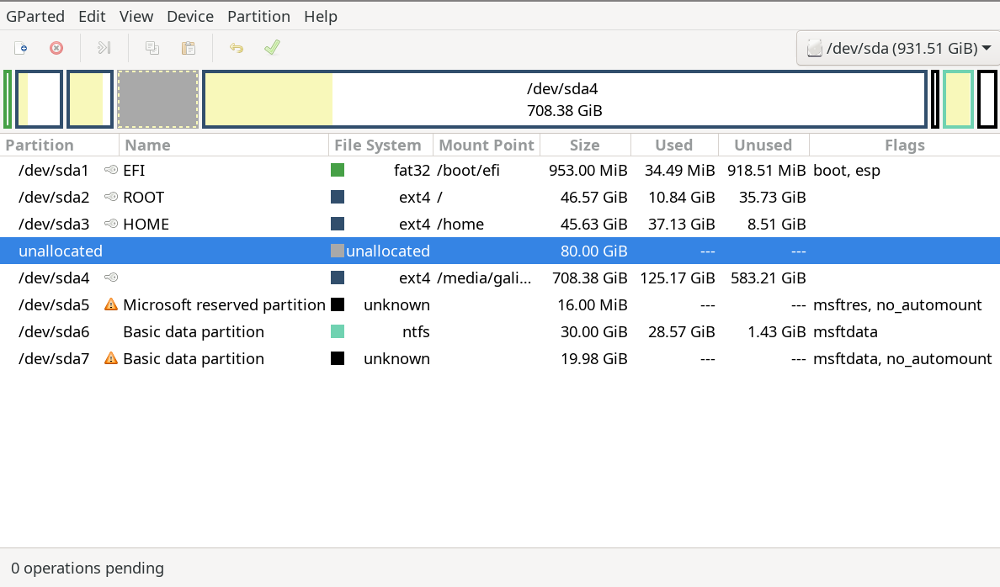
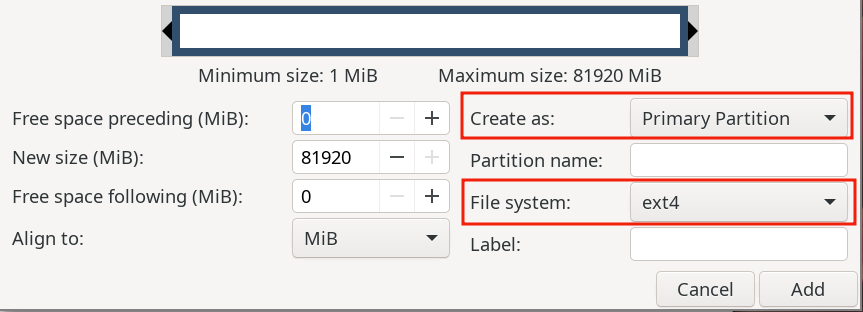
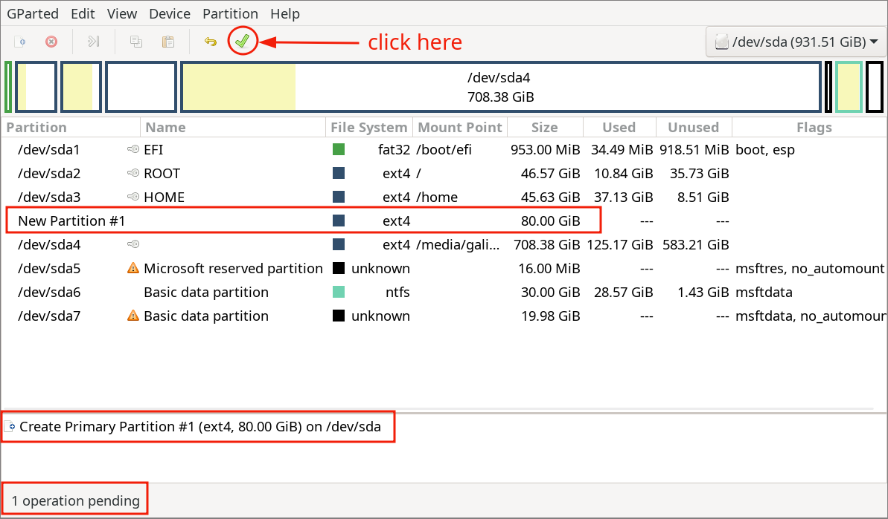
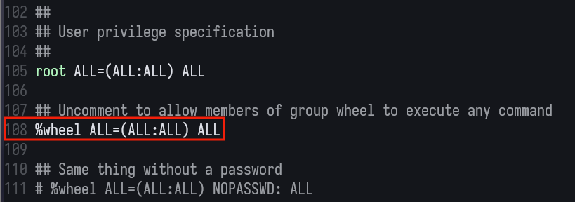
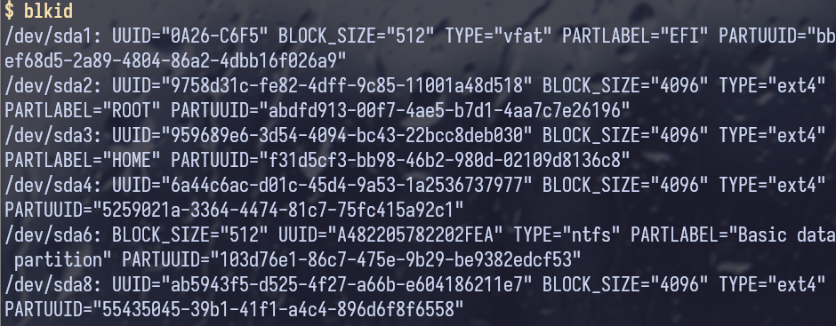

+++
title = "Install Void Linux from Debian"
date = "2024-10-07 20:39:49"
tags = ["voidlinux", "debian", "linux", "installation"]
+++
## Download the installation media
At first, go to the [download page](https://voidlinux.org/download/) of void linux and download rootfs tarball (i downloaded the glibc version).


## Create partitions
For simplicity, i created only the root partition `/`, no swap, no EFI partition. My existing system already has an EFI partition mounted at `/boot/efi`. I used [gparted](https://gparted.org/) for creating partitions.

Launch gparted and manage some unallocated space. I shrunk one of my existing partitions and kept 80 GB of unallocated space.


Now create a partition in that space and format it to ext4.


This will create a new 80 GB ext4 partition and it will be named as `/dev/sdXY` or `/dev/nvmeXnYpZ`. On my device the new partition is `/dev/sda8`.

## Create a chroot environment
- Mount the newly created partition to `/mnt` and extract the rootfs tarball to `/mnt`
```
sudo mount /dev/sda8 /mnt
sudo tar xvf path/to/the/tarball -C /mnt
```
- Now download the xchroot program from xtools repository & make it executable.
```
wget https://raw.githubusercontent.com/leahneukirchen/xtools/refs/heads/master/xchroot
chmod +x xchroot
```
- Now enter the chroot.
```
sudo ./xchroot /mnt /bin/bash
```


## Install the base system
```
xbps-install -Su xbps
xbps-install -u
xbps-install base-system
xbps-remove base-container-full
```

## Configure the system
We may need to do some editing. So, install neovim (or any other terminal based text editor with which you are familiar with)
```
xbps-install neovim
```
Now set the hostname in `/etc/hostname` file.
```
echo voidlinux > /etc/hostname
```
Set the root password.
```
passwd
```
Now add a normal user and add him to necessary groups. Set a password for the user and modify the sudoers file to allow root permissions.
```
useradd -m name_of_user
usermod -aG wheel,audio,video,storage,network,input,plugdev,users name_of_user
passwd name_of_user
EDITOR=nvim visudo
```
Uncomment the following line to allow users of the wheel group root permissions.


## Configure the `/etc/fstab` file. 
It is the file that defines where to mount which partition on boot automatically. The root partition is at `/dev/sda8` in my case. 
Find the EFI partition from debian. No need to exit the chroot, just launch another terminal and run `lsblk`. Look for the partition mounted at `/boot/efi` which is `/dev/sda1` in my case.

Write the `/etc/fstab` file as follows
```
echo "/dev/sda8 / ext4 rw,relatime 0 1" > /etc/fstab
echo "/dev/sda1 /boot/efi vfat rw,relatime,umask=0077,errors=remount-ro 0 2" >> /etc/fstab
echo "tmpfs /tmp tmpfs defaults,nosuid,nodev 0 0" >> /etc/fstab
```
Now use the `blkid` command to get the UUID of the partitions and replace `/dev/sdXX`s with their UUIDs in the `/etc/fstab` file.

Now the `/etc/fstab` file should look like this

Make the `/boot/efi` directory because we did not mount it in the chroot

## Installing NetworkManager
Install NetworkManager to manage wired and wireless networks. 
```
xbps-install NetworkManager
```
Enable necessary services to make NetworkManager usable.
```
ln -s /etc/sv/dbus /etc/runit/runsvdir/default/
ln -s /etc/sv/NetworkManager /etc/runit/runsvdir/default/
```

## Final steps
Reconfigure the system, all the installed packages and exit the chroot.
```
xbps-reconfigure -fa
exit
```
Update grub in your debian system to list voidlinux in the grub menu.
```
sudo update-grub
```
Now reboot and select Void Linux from the grub menu.

