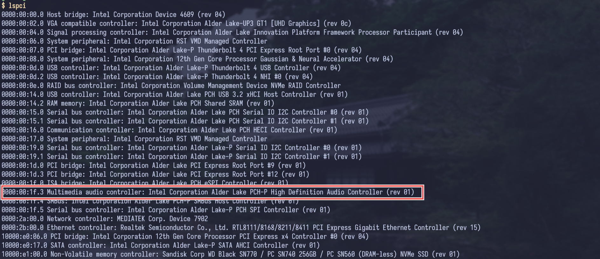
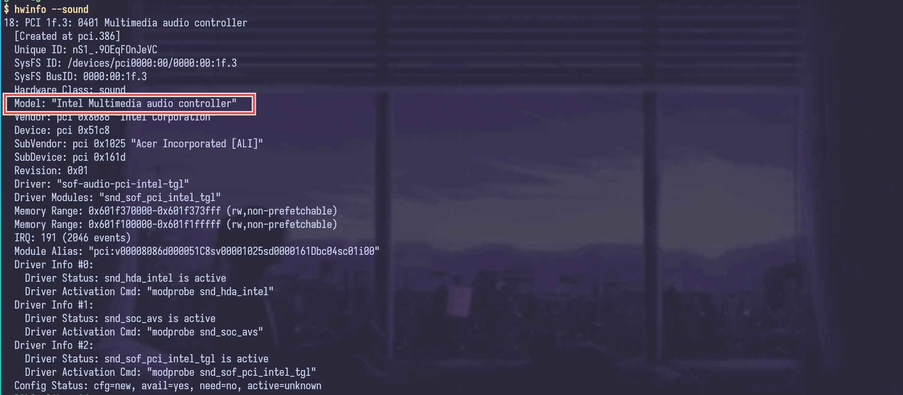

+++
date = '2025-06-01T01:20:17+06:00'
title = 'Setting Up Sound Using Pipewire'
tags = ["pipewire", "linux", "alsa", "pulseaudio", "sof"]
[cover]
    image = "/tech/setting-up-sound-using-pipewire/thumbnail.png"
+++

For setting up the sound system in Linux, we need both hardware (sound card) and software (kernel drivers, sound servers, volume control etc). 
`sound card -> kernel drivers -> sound servers -> applications`
So, first we need to check our hardware.

using `lspci`


using `hwinfo`


## Kernel drivers
### Sound Open Firmware
In my laptop, the sound card is intel's audio controller. Usually, sound is processed by the cpu, but since intel core 10th generation and onwards, they have separated the audio processing functionality from the processor and offloaded it to an integrated small digital signal processor (DSP). For this new type of sound processing hardware, new firmware is needed.

From wikipedia, 
> In computing, firmware is software that provides low-level control of computing device hardware.

For linux community, intel created an open-source firmware called the **Sound Open Firmware**. As my intel processor is 12th generation (above 10th), I need sound open firmware which is available as a binary package `sof-firmware` in the void linux repositories.

### Advanced Linux Sound Architecture (ALSA)
ALSA provides kernel driven sound card drivers. From wikipedia,
> Advanced Linux Sound Architecture (ALSA) is a software framework and part of the Linux kernel that provides an application programming interface (API) for sound card device drivers.

We can install ALSA by installing `alsa-utils` package. We also need `alsa-firmware` which may be needed for some other sound devices we may use. 

## Sound Servers
### Pulseaudio
From ArchWiki, 
> PulseAudio is a general purpose sound server intended to run as a middleware between your applications and your hardware devices, using ALSA

So, for communicating with ALSA, we need sound servers because ALSA is too low level. Most of the applications use Pulseaudio, but there is a modern alternative called Pipewire. We will be using that. But as many applications rely solely on pulseaudio we need to install `pulseaudio` and to enable ALSA for pulseaudio communication, we need `alsa-plugins` package.
### Pipewire
From ArchWiki,
> PipeWire is a new low-level multimedia framework. It aims to offer capture and playback for both audio and video with minimal latency and support for PulseAudio and ALSA based applications.

`pipewire` is so minimal that it doesn't come with the connection logic, we need session managers for this. `wireplumber` is the recommended session manager for `pipewire`. For comminucating with ALSA, we need `alsa-pipewire`.

## Installing the packages
So we need the following packages
- `sof-firmware`
- `alsa-firmware`
- `alsa-utils`
- `alsa-plugins`
- `alsa-pipewire`
- `pulseaudio`
- `pipewire`
- `wireplumber`

Install these by running 
```bash
sudo xbps-install sof-firmware alsa-firmware alsa-utils alsa-plugins alsa-pipewire pulseaudio pipewire wireplumber
```
Now enable the alsa service by running
```bash
sudo ln -s /etc/sv/alsa /etc/runit/runsvdir/default/
```
Add `pipewire` and `wireplumber` to autostart script of your window manager. I am using `hyprland`, so I will add the following lines to my `~/.config/hypr/hyprland.conf` file.
```hyprlang
exec-once = pipewire
exec-once = wireplumber
```

## Disabling pulseaudio
We need to disable the autostart option of `pulseaudio` to prevent blocking of the conncetion socket, because it will be used by `pipewire`.

From `man pulse-client.conf`
```man
autospawn= Autospawn a PulseAudio daemon when needed. Takes a boolean
       value, defaults to yes. Note that setting this to "no" doesn't disable
       the systemd service. The autospawn option is only meant to be used on
       systems without systemd. If you use systemd to start PulseAudio, use
       "systemctl --user stop pulseaudio.service pulseaudio.socket" to stop
       the daemon temporarily, or "systemctl --user mask pulseaudio.service
       pulseaudio.socket" to permanently disable the units (the "disable"
       command of systemctl probably won't work, because the pulseaudio.socket
       unit is often installed to /usr/lib/systemd/user/sockets.target.wants/,
       which makes it impossible to disable the unit with the "disable"
       command).
```
As void linux doesn't have systemd, we need to use this autospawn option in `/etc/pulse/client.conf`.
```conf
; autospawn = no
```

## Starting pulseaudio from pipwire
The PulseAudio interface is optional but highly recommended. Most applications cannot speak directly to PipeWire, but instead speak to PipeWire's PulseAudio interface.

Modify the PipeWire configuration to launch `pipewire-pulse`:
```bash
sudo mkdir -p /etc/pipewire/pipewire.conf.d
sudo ln -s /usr/share/examples/pipewire/20-pipewire-pulse.conf /etc/pipewire/pipewire.conf.d/
```

## Reboot
Now reboot the system to load the drivers and services properly. You can install `pavucontrol` or `pavucontrol-qt` or `pwvucontrol` for controling the volume.
