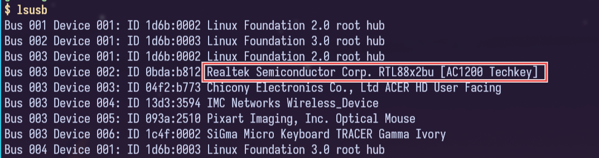
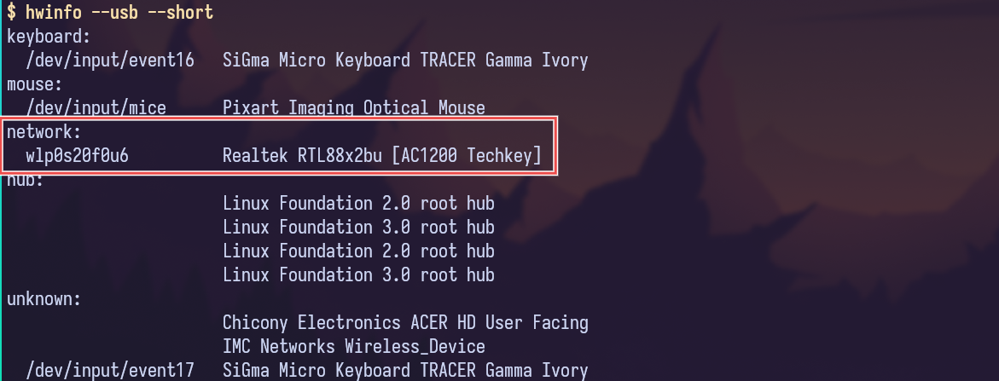

+++
date = '2025-05-25T16:07:36+06:00'
title = 'Using USB Wifi Adapter in Linux'
tags = ["linux", "wifi", "kernel", "driver", "dkms"]
+++

My Acer laptop doesn't have a linux-supported built-in wireless adapter. It has MediaTek mt7902 chipset which doesn't have any drivers for linux. MediaTek doesn't like linux and if you don't know the firmware code and how it works, you cannot write a driver for it. I searched around in google but didn't find any solution. After doing some research I decided to buy a USB adapter. Those with drivers baked in the linux kernel were expensive, so I bought a cheap one,  from StarTech.

This usb adapter has its linux driver package in their . But this driver didn't work well. the adapter kept getting disconnecting and reconnecting. In the driver package folder their was a README.md in which I found a github .

## Identify your adapter
Run `lsusb`, this may not always specify which one is the wifi adapter but most of the time this command is sufficient. 

If you do not understand the output or can't find which one is the wifi adapter, install `hwinfo` and run `hwinfo --usb --short`. 

Now search for its drivers in google, github, reddit and other places.

## DKMS
DKMS stands for Dynamic Kernel Module Support. DKMS is a system that automatically recompiles and reinstalls kernel modules (like Wi-Fi or GPU drivers) whenever your Linux kernel is updated. This saves you from having to manually reinstall out-of-tree drivers after each kernel upgrade. Some drivers (like for USB Wi-Fi adapters) are not built into the mainline kernel. If you install them manually, they break every time your kernel updates — unless you rebuild them. DKMS automates this.

### How it works (in short):
- You install a driver source via DKMS.
- DKMS compiles it for your current kernel.
- When a new kernel is installed:
    - DKMS is triggered automatically.
    - It rebuilds the driver for the new kernel.
    - Your device continues working — no manual steps needed.

### Installation
```bash
git clone "https://github.com/RinCat/RTL88x2BU-Linux-Driver.git" /usr/src/rtl88x2bu-git
sed -i 's/PACKAGE_VERSION="@PKGVER@"/PACKAGE_VERSION="git"/g' /usr/src/rtl88x2bu-git/dkms.conf
dkms add -m rtl88x2bu -v git
dkms autoinstall
```

## Blacklisting rtw88
Starting from Linux 5.18, some distributions have added experimental RTW88 USB support (include RTW88x2BU support). It is not yet stable but if it works well on your system, then you no longer need this driver. But if it doesn't work or is unstable, you need to manually blacklist it because it has a higher loading priority than this external drivers. Check the currently loaded module using `lsmod`. If you see `rtw88_core`, `rtw88_usb`, or any name beginning with rtw88_ then you are using the RTW88 driver. If you see `88x2bu` then you are using this RTW88x2BU driver.

To blacklist RTW88 8822bu USB driver, run the following command:
```bash
echo "blacklist rtw88_8822bu" > /etc/modprobe.d/rtw8822bu.conf
```
And reboot your system.

